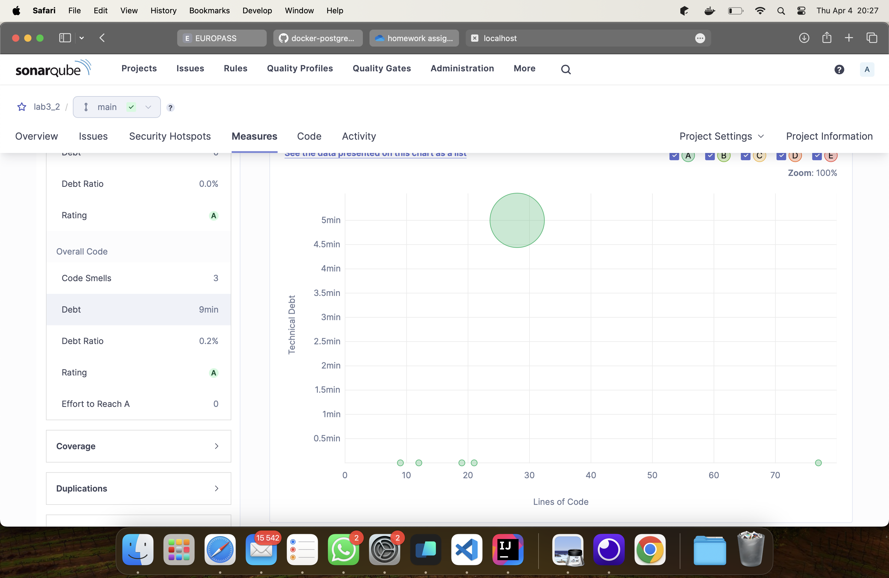
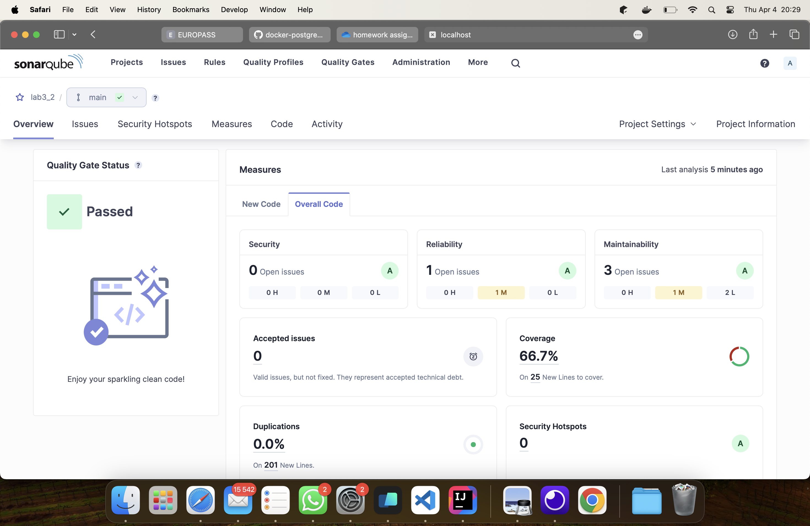
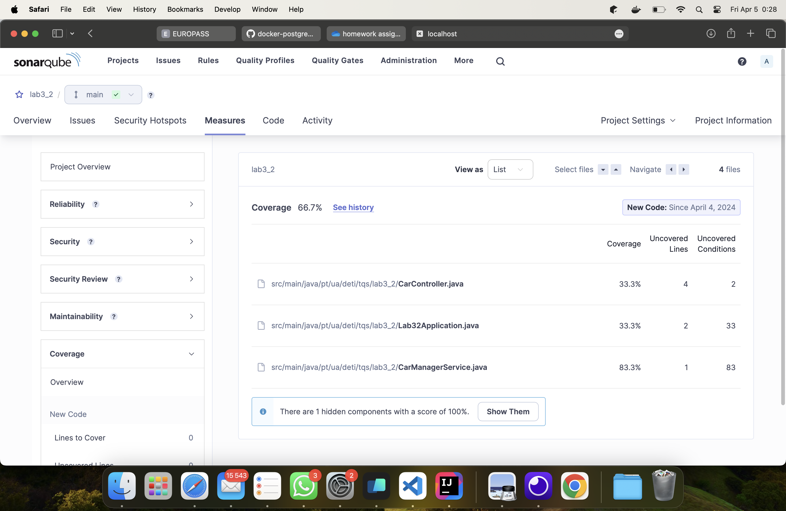

# Exercise 6.2

## Technical debt

It means the estimated time to fix issues found by Sonar.
In this project, the debt is 9 minutes.

## Coverage

Coverage is at 66.7%, which is only satisfactory.

Regarding new code, there are seven lines and 113 conditions that are not
tested.

